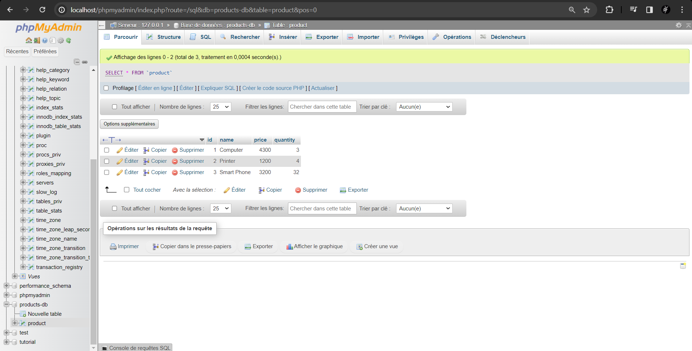
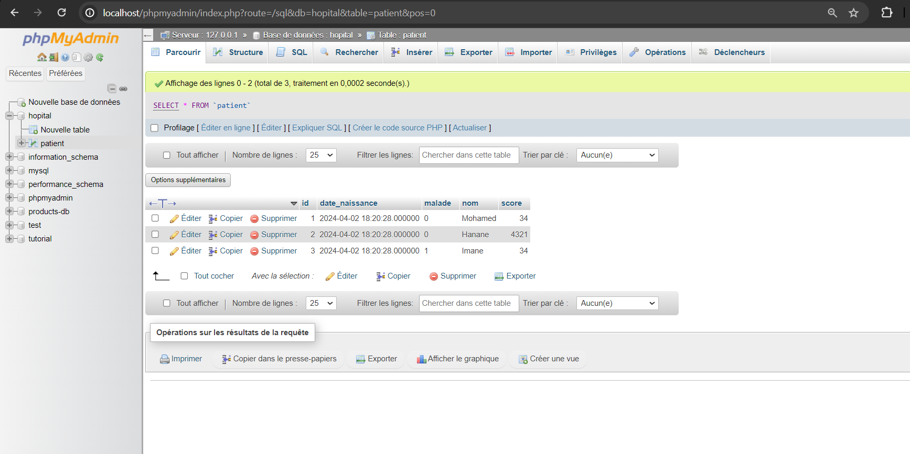
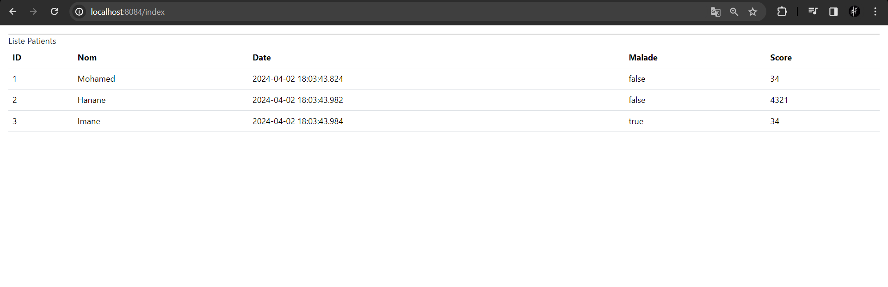
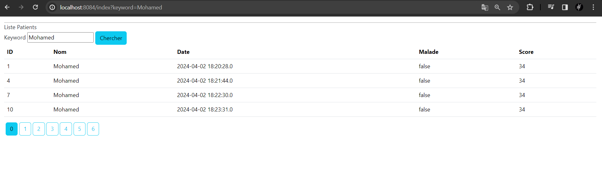
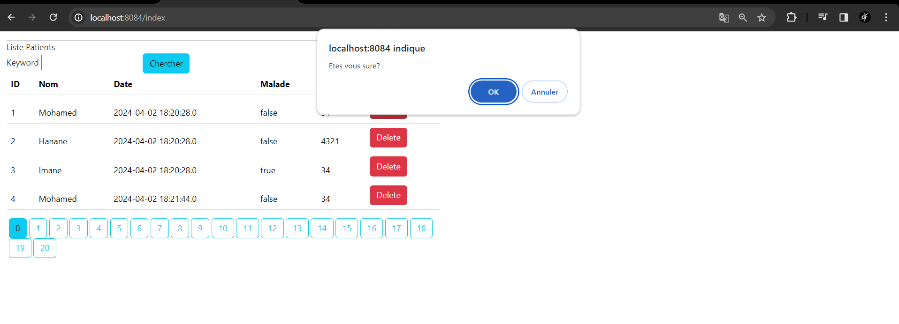
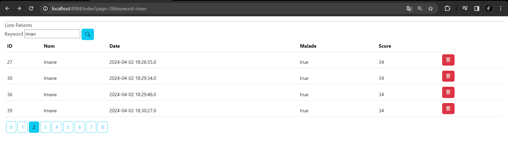

<h2>Compte rendu </h2>
<h4>L'ajout des différents patient dans la base de données h2-console:</h4>

<h4>L'ajout des différents patient dans la base de données MySQL</h4>

<h4>L'affichage des patients</h4>

<h4>Barre de recherche</h4>

<h4>Suppression d'un patient</h4>

<h4>L'ajout d'icone bootstrap</h4>

